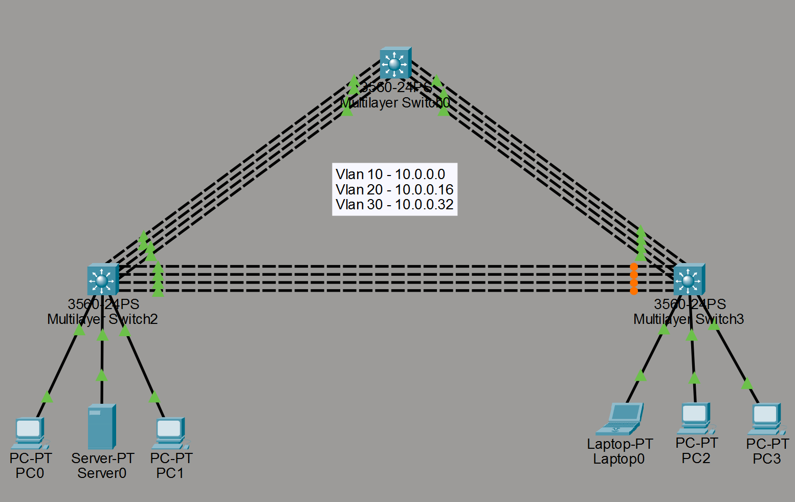

# Spanning Tree Protocol & EtherChannel (with L3 Distribution)

## Objective

Build a redundant three-switch triangle topology, bundle the redundant links with EtherChannel (LACP) to eliminate STP blocking *within* each pair of switches, let STP handle the remaining loop at the topology level, and route between VLANs at a single Layer 3 distribution switch.

## Topology



- 3x 3560-24PS multilayer switches in a triangle: **Switch0** (core/aggregation), **Switch2** (root bridge + L3 distribution), **Switch3** (access)
- Each switch-to-switch link is a **4-port LACP EtherChannel** (Fa0/1–4 and Fa0/5–8 bundled into Port-channel interfaces)
- End devices: PC0, Server0, PC1 on Switch2 · Laptop0, PC2, PC3 on Switch3
- VLANs, /28 each:

  | VLAN | Subnet | Gateway (SVI) |
  |---|---|---|
  | 10 | 10.0.0.0/28 | 10.0.0.1 |
  | 20 | 10.0.0.16/28 | 10.0.0.17 |
  | 30 | 10.0.0.32/28 | 10.0.0.33 |

- Devices are mirrored across VLANs on both access switches (PC0/Laptop0 → VLAN 10, Server0/PC2 → VLAN 20, PC1/PC3 → VLAN 30) so inter-VLAN traffic has to cross the trunk and get routed at Switch2.

## What I configured

**EtherChannel (LACP)**
- Bundled each 4-link connection between switches into a single Port-channel using `channel-group <n> mode active` on both ends
- Configured the Port-channel interfaces as 802.1Q trunks (not the physical member ports individually)

**STP**
- Set Switch2 as root bridge for all in-use VLANs (`spanning-tree vlan 1,10,20,30 root primary`)
- With the triangle formed by three Port-channels (Switch0↔Switch2, Switch2↔Switch3, Switch0↔Switch3), STP still has one redundant path to block — since EtherChannel eliminates the loop *within* each link, but the three-way triangle at the topology level is still a loop
- In this topology, **Switch3's Port-channel to Switch2 ends up in the blocking state**; Switch3 reaches Switch2 via Switch0 instead

**Layer 3 distribution**
- Only Switch2 has `ip routing` enabled and SVIs for VLANs 10/20/30
- Switch0 and Switch3 stay Layer 2 — pure trunking/EtherChannel, no SVIs

## Key commands used

```
interface range fastEthernet0/1 - 4
 switchport trunk encapsulation dot1q
 switchport mode trunk
 channel-group 1 mode active
 channel-protocol lacp

interface Port-channel1
 switchport trunk encapsulation dot1q
 switchport mode trunk

spanning-tree mode rapid-pvst
spanning-tree vlan 1,10,20,30 root primary

ip routing
interface vlan 10
 ip address 10.0.0.1 255.255.255.240
 no shutdown
```

## Verification

```
show etherchannel summary
show spanning-tree
show vlan brief
show ip interface brief
show ip route
```

## What I learned / issues hit

- EtherChannel doesn't remove STP from the picture — it just collapses 4 physical links into one logical link so STP only has to make *one* blocking decision per switch pair instead of blocking 3 of the 4 redundant physical links.
- Even with all three switch-pair links bundled, the triangle *between* switches is still a loop at the logical level, so STP blocks one whole Port-channel — worth remembering that EtherChannel and STP solve loops at different layers (physical vs. topological).
- Centralizing all SVIs on one distribution switch (rather than putting SVIs on every multilayer switch) meant every inter-VLAN packet had to reach Switch2 specifically — good practice for understanding why real designs often pick a dedicated distribution layer instead of routing everywhere.
- Losing all CLI state on reopening the Packet Tracer file (a known PT quirk when device configs aren't saved with `copy run start` before closing) — worth doing `write memory` before every save from now on.

## Configs

See [`/configs`](./Configs) for the reconstructed switch configurations from this lab (Switch0, Switch2, Switch3).
